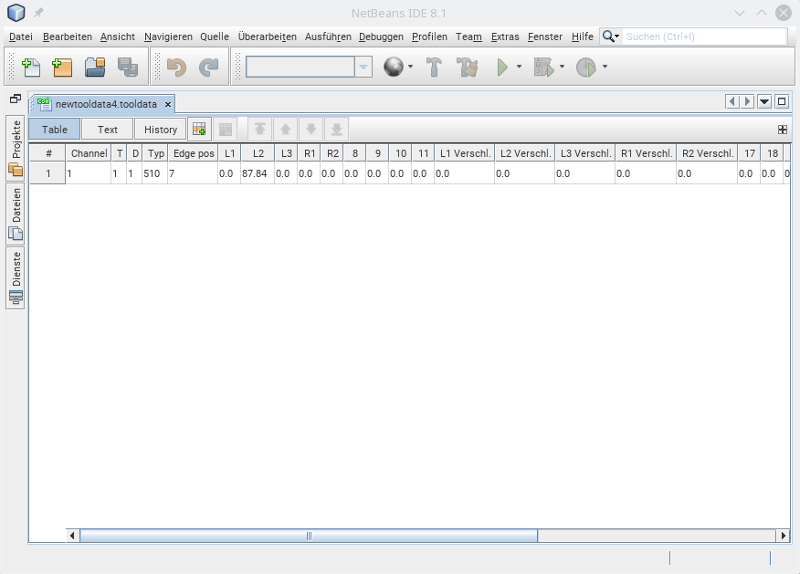
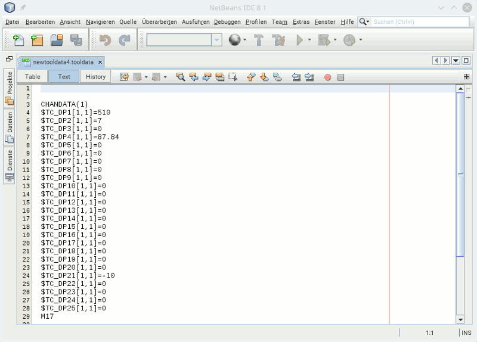

This is a editor for tool data files from a Sinumerik 840D.

I have modified the plugin: [NB CSV Editor](https://bitbucket.org/draganbjedov/nb-csv-editor)

# Usage #

The file extension ".tooldata" is recognized as a tool data file.
It is easy to edit the data:

